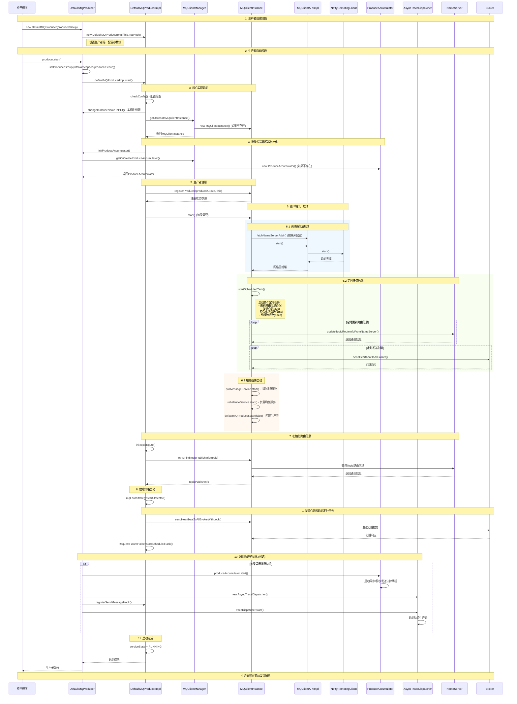

# RocketMQ生产者初始化时序图
## 概述
本文档展示了RocketMQ生产者从创建到完全启动的完整初始化流程，聚焦于关键的初始化步骤和组件交互。
## 时序图

## 关键流程说明
### 1. 生产者创建 (Constructor)
- 创建 `DefaultMQProducer` 实例
- 初始化 `DefaultMQProducerImpl` 作为核心实现
- 设置生产者组、RPC钩子等基础配置
### 2. 配置检查与实例管理
- 检查生产者组名、NameServer地址等配置
- 设置实例名为进程ID以确保唯一性
- 通过 `MQClientManager` 获取或创建 `MQClientInstance`
### 3. 批量发送累积器初始化
- 初始化 `ProduceAccumulator` 用于批量发送优化
- 启动同步和异步发送的守护线程
- 配置批量大小、延迟时间等参数
### 4. 网络通信层启动
- 启动基于Netty的 `RemotingClient`
- 建立与NameServer和Broker的网络连接
- 注册各种RPC钩子和处理器
### 5. 定时任务启动
- **路由更新任务**: 每30秒从NameServer更新Topic路由信息
- **心跳任务**: 每30秒向所有Broker发送心跳
- **消费进度持久化**: 每5秒持久化消费者偏移量
- **线程池调整**: 每分钟调整线程池大小
### 6. 路由信息初始化
- 从NameServer获取预配置Topic的路由信息
- 构建 `TopicPublishInfo` 用于消息发送时的队列选择
- 缓存路由信息以提高发送性能
### 7. 故障检测与恢复
- 启动延迟故障检测机制
- 监控Broker可用性和响应延迟
- 实现故障Broker的自动规避和恢复
### 8. 消息轨迹 (可选)
- 如果启用轨迹功能，创建 `AsyncTraceDispatcher`
- 注册发送和事务钩子用于轨迹数据收集
- 启动独立的轨迹生产者发送轨迹消息
## 初始化完成标志
当所有上述步骤完成后，生产者状态设置为 `RUNNING`，此时生产者已完全就绪，可以开始发送消息。整个初始化过程确保了：
- 网络连接建立
- 路由信息获取
- 定时任务运行
- 故障检测启动
- 批量发送优化就绪