# RocketMQ生产者初始化类图

## 概述
本文档展示了RocketMQ生产者初始化过程中涉及的主要类和接口之间的继承、实现和组合关系。

## 问题记录
### 为什么DefaultMQProducer要ClientConfig实现MQProducer

## 类图

```mermaid
classDiagram
    %% 接口定义
    class MQAdmin {
        <<interface>>
        +createTopic(key, newTopic, queueNum, attributes)
        +searchOffset(mq, timestamp)
        +maxOffset(mq)
        +minOffset(mq)
        +viewMessage(topic, msgId)
    }

    class MQProducer {
        <<interface>>
        +start()
        +shutdown()
        +send(msg)
        +send(msg, timeout)
        +send(msg, sendCallback)
        +sendOneway(msg)
        +fetchPublishMessageQueues(topic)
    }

    class MQProducerInner {
        <<interface>>
        +getPublishTopicList()
        +isPublishTopicNeedUpdate(topic)
        +updateTopicPublishInfo(topic, info)
        +checkTransactionState(addr, msg, header)
        +isUnitMode()
    }

    class TraceDispatcher {
        <<interface>>
        +start(nameSrvAddr, accessChannel)
        +append(ctx)
        +flush()
        +shutdown()
    }

    class StartAndShutdown {
        <<interface>>
        +start()
        +shutdown()
    }

    class RemotingClient {
        <<interface>>
        +start()
        +shutdown()
        +invokeSync(addr, request, timeoutMillis)
        +invokeAsync(addr, request, timeoutMillis, callback)
        +invokeOneway(addr, request, timeoutMillis)
    }

    %% 抽象类
    class ServiceThread {
        <<abstract>>
        #thread: Thread
        #waitPoint: CountDownLatch2
        #hasNotified: AtomicBoolean
        #stopped: boolean
        +start()
        +shutdown()
        +wakeup()
        +waitForRunning(interval)
        +run()* abstract
        +getServiceName()* abstract
    }

    class ClientConfig {
        -namesrvAddr: String
        -clientIP: String
        -instanceName: String
        -heartbeatBrokerInterval: int
        -pollNameServerInterval: int
        -enableTrace: boolean
        +buildMQClientId()
        +changeInstanceNameToPID()
        +cloneClientConfig()
    }

    %% 核心实现类
    class DefaultMQProducer {
        -producerGroup: String
        -defaultMQProducerImpl: DefaultMQProducerImpl
        -produceAccumulator: ProduceAccumulator
        -enableTrace: boolean
        -traceDispatcher: TraceDispatcher
        +start()
        +shutdown()
        +send(msg)
        +sendByAccumulator(msg, mq, callback)
        +sendDirect(msg, mq, callback)
    }

    class TransactionMQProducer {
        -transactionListener: TransactionListener
        -executorService: ExecutorService
        -checkThreadPoolMinSize: int
        -checkThreadPoolMaxSize: int
        +start()
        +shutdown()
        +sendMessageInTransaction(msg, arg)
    }

    class DefaultMQProducerImpl {
        -defaultMQProducer: DefaultMQProducer
        -mQClientFactory: MQClientInstance
        -topicPublishInfoTable: ConcurrentMap
        -serviceState: ServiceState
        -mqFaultStrategy: MQFaultStrategy
        +start(startFactory)
        +send(msg)
        +checkConfig()
        +initTopicRoute()
    }

    %% 客户端管理类
    class MQClientManager {
        <<singleton>>
        -factoryTable: ConcurrentMap~String, MQClientInstance~
        -accumulatorTable: ConcurrentMap~String, ProduceAccumulator~
        +getInstance()
        +getOrCreateMQClientInstance(clientConfig, rpcHook)
        +getOrCreateProduceAccumulator(clientConfig)
    }

    class MQClientInstance {
        -clientConfig: ClientConfig
        -clientId: String
        -producerTable: ConcurrentMap~String, MQProducerInner~
        -consumerTable: ConcurrentMap~String, MQConsumerInner~
        -mQClientAPIImpl: MQClientAPIImpl
        -pullMessageService: PullMessageService
        -rebalanceService: RebalanceService
        -serviceState: ServiceState
        +start()
        +registerProducer(group, producer)
        +sendHeartbeatToAllBrokerWithLock()
        +updateTopicRouteInfoFromNameServer()
    }

    %% 网络通信类
    class MQClientAPIImpl {
        -remotingClient: RemotingClient
        -clientConfig: ClientConfig
        -topAddressing: TopAddressing
        +start()
        +shutdown()
        +sendHeartbeat(addr, heartbeatData, timeout)
        +sendMessage(addr, brokerName, msg, header, timeout)
        +fetchNameServerAddr()
    }

    class NettyRemotingClient {
        -nettyClientConfig: NettyClientConfig
        -bootstrap: Bootstrap
        -eventLoopGroupWorker: EventLoopGroup
        -channelTables: ConcurrentMap
        -publicExecutor: ExecutorService
        +start()
        +shutdown()
        +invokeSync(addr, request, timeoutMillis)
        +getAndCreateChannel(addr)
    }

    %% 服务线程类
    class PullMessageService {
        -messageRequestQueue: LinkedBlockingQueue
        -mQClientFactory: MQClientInstance
        -scheduledExecutorService: ScheduledExecutorService
        +run()
        +executePullRequestImmediately(pullRequest)
        +getServiceName()
    }

    class RebalanceService {
        -mqClientFactory: MQClientInstance
        -lastRebalanceTimestamp: long
        +run()
        +getServiceName()
    }

    %% 批量发送相关
    class ProduceAccumulator {
        -syncSendBatchs: Map~AggregateKey, MessageAccumulation~
        -asyncSendBatchs: Map~AggregateKey, MessageAccumulation~
        -guardThreadForSyncSend: GuardForSyncSendService
        -guardThreadForAsyncSend: GuardForAsyncSendService
        -totalHoldSize: long
        -holdSize: long
        -holdMs: int
        +start()
        +send(msg, mq, producer)
        +send(msg, mq, callback, producer)
    }

    %% 消息轨迹相关
    class AsyncTraceDispatcher {
        -traceProducer: DefaultMQProducer
        -traceContextQueue: ArrayBlockingQueue
        -traceExecutor: ThreadPoolExecutor
        -hostProducer: DefaultMQProducerImpl
        -batchNum: int
        -maxMsgSize: int
        +start(nameSrvAddr, accessChannel)
        +append(ctx)
        +flush()
        +shutdown()
    }

    %% 继承关系
    MQProducer --|> MQAdmin : extends
    DefaultMQProducer --|> ClientConfig : extends
    DefaultMQProducer ..|> MQProducer : implements
    TransactionMQProducer --|> DefaultMQProducer : extends
    DefaultMQProducerImpl ..|> MQProducerInner : implements

    PullMessageService --|> ServiceThread : extends
    RebalanceService --|> ServiceThread : extends

    NettyRemotingClient ..|> RemotingClient : implements
    MQClientAPIImpl ..|> StartAndShutdown : implements
    AsyncTraceDispatcher ..|> TraceDispatcher : implements

    %% 组合关系
    DefaultMQProducer *-- DefaultMQProducerImpl : contains
    DefaultMQProducer *-- ProduceAccumulator : contains
    DefaultMQProducer *-- TraceDispatcher : contains

    DefaultMQProducerImpl *-- MQClientInstance : contains
    DefaultMQProducerImpl *-- MQFaultStrategy : contains

    MQClientInstance *-- MQClientAPIImpl : contains
    MQClientInstance *-- PullMessageService : contains
    MQClientInstance *-- RebalanceService : contains
    MQClientInstance *-- ClientConfig : contains

    MQClientAPIImpl *-- RemotingClient : contains
    MQClientAPIImpl *-- ClientConfig : contains

    MQClientManager *-- MQClientInstance : manages
    MQClientManager *-- ProduceAccumulator : manages

    AsyncTraceDispatcher *-- DefaultMQProducer : contains

    %% 依赖关系
    DefaultMQProducerImpl ..> MQClientManager : uses
    MQClientInstance ..> MQProducerInner : registers

    %% 注释 - 接口职责
    note for MQAdmin "MQ管理接口\n定义Topic创建、查询等管理操作\n提供消息查看、偏移量查询功能"
    note for MQProducer "生产者标准接口\n定义消息发送契约\n支持同步、异步、单向发送\n继承MQ管理能力"
    note for MQProducerInner "生产者内部接口\n定义内部实现需要的方法\n支持Topic路由更新\n处理事务状态检查"
    note for TraceDispatcher "消息轨迹分发接口\n定义轨迹数据处理契约\n支持轨迹数据异步发送\n提供轨迹生命周期管理"
    note for StartAndShutdown "启停控制接口\n定义组件生命周期契约\n统一启动和关闭规范"
    note for RemotingClient "远程通信客户端接口\n定义网络通信契约\n支持同步、异步、单向调用\n管理连接和通道"

    %% 注释 - 抽象类职责
    note for ServiceThread "服务线程抽象基类\n提供统一的线程生命周期管理\n支持线程等待和唤醒机制\n实现优雅关闭和状态控制"
    note for ClientConfig "客户端通用配置类\n管理NameServer地址配置\n提供网络、心跳、轨迹等参数\n支持客户端ID生成和命名空间处理"

    %% 注释 - 核心实现类职责
    note for DefaultMQProducer "默认生产者门面类\n继承ClientConfig获得配置能力\n实现MQProducer提供用户API\n委托DefaultMQProducerImpl处理业务\n管理批量发送和消息轨迹功能"
    note for TransactionMQProducer "事务消息生产者\n继承DefaultMQProducer扩展事务能力\n管理事务监听器和检查线程池\n处理事务消息的发送和回查"
    note for DefaultMQProducerImpl "生产者核心实现类\n实现MQProducerInner接口\n处理消息发送的具体逻辑\n管理Topic路由信息和故障策略\n协调客户端实例和网络通信"

    %% 注释 - 客户端管理类职责
    note for MQClientManager "客户端管理器(单例)\n管理所有MQClientInstance实例\n按clientId复用客户端连接\n管理ProduceAccumulator实例\n提供资源的统一创建和回收"
    note for MQClientInstance "MQ客户端实例\n管理生产者和消费者注册\n协调网络通信和各种服务\n处理心跳、路由更新等定时任务\n提供负载均衡和消息拉取服务"

    %% 注释 - 网络通信类职责
    note for MQClientAPIImpl "MQ客户端API实现\n封装与NameServer和Broker的通信\n处理消息发送、心跳、路由查询\n管理网络连接和请求响应\n实现StartAndShutdown生命周期"
    note for NettyRemotingClient "Netty远程通信客户端\n实现RemotingClient接口\n基于Netty管理网络连接\n处理连接池和通道管理\n支持同步异步通信模式"

    %% 注释 - 服务线程类职责
    note for PullMessageService "消息拉取服务线程\n继承ServiceThread获得线程管理能力\n处理消息拉取请求队列\n支持延时和立即拉取\n为消费者提供消息拉取服务"
    note for RebalanceService "负载均衡服务线程\n继承ServiceThread获得线程管理能力\n定期执行消费者负载均衡\n处理队列分配和重新平衡\n确保消费者负载均匀分布"

    %% 注释 - 批量发送相关职责
    note for ProduceAccumulator "消息批量发送累积器\n优化消息发送性能\n管理同步和异步批量发送\n控制批量大小和延迟时间\n提供守护线程处理批量发送"

    %% 注释 - 消息轨迹相关职责
    note for AsyncTraceDispatcher "异步消息轨迹分发器\n实现TraceDispatcher接口\n异步收集和发送轨迹数据\n管理轨迹生产者和执行器\n支持轨迹数据的批量处理"
```

## 关键关系说明

### 🔗 **继承关系 (Inheritance)**

1. **接口继承**
   - `MQProducer` extends `MQAdmin` - 生产者接口继承管理接口
   - `DefaultMQProducer` extends `ClientConfig` - 生产者继承客户端配置

2. **类继承**
   - `TransactionMQProducer` extends `DefaultMQProducer` - 事务生产者扩展默认生产者
   - `PullMessageService` extends `ServiceThread` - 拉取服务继承服务线程基类
   - `RebalanceService` extends `ServiceThread` - 负载均衡服务继承服务线程基类

### 🎯 **接口实现 (Implementation)**

1. **生产者实现**
   - `DefaultMQProducer` implements `MQProducer` - 默认生产者实现生产者接口
   - `DefaultMQProducerImpl` implements `MQProducerInner` - 内部实现类实现内部接口

2. **网络通信实现**
   - `NettyRemotingClient` implements `RemotingClient` - Netty客户端实现远程通信接口
   - `MQClientAPIImpl` implements `StartAndShutdown` - API实现类实现启停接口

3. **消息轨迹实现**
   - `AsyncTraceDispatcher` implements `TraceDispatcher` - 异步轨迹分发器实现轨迹接口

### 🏗️ **组合关系 (Composition)**

1. **生产者组合**
   - `DefaultMQProducer` 包含 `DefaultMQProducerImpl` - 门面模式
   - `DefaultMQProducer` 包含 `ProduceAccumulator` - 批量发送优化
   - `DefaultMQProducer` 包含 `TraceDispatcher` - 消息轨迹功能

2. **客户端实例组合**
   - `MQClientInstance` 包含各种服务组件（API、拉取服务、负载均衡服务）
   - `MQClientInstance` 管理生产者和消费者实例

3. **网络层组合**
   - `MQClientAPIImpl` 包含 `RemotingClient` - 网络通信抽象
   - `NettyRemotingClient` 管理Netty相关组件

### 📊 **管理关系 (Management)**

1. **单例管理**
   - `MQClientManager` 单例管理所有 `MQClientInstance`
   - 按 `clientId` 复用客户端实例，提高资源利用率

2. **注册管理**
   - `MQClientInstance` 注册和管理 `MQProducerInner` 实例
   - 支持多个生产者共享同一个客户端实例

### 🎨 **设计模式体现**

1. **门面模式 (Facade)**
   - `DefaultMQProducer` 作为门面，隐藏 `DefaultMQProducerImpl` 的复杂性

2. **单例模式 (Singleton)**
   - `MQClientManager` 确保全局唯一的客户端管理器

3. **模板方法模式 (Template Method)**
   - `ServiceThread` 定义服务线程的通用生命周期，子类实现具体逻辑

4. **策略模式 (Strategy)**
   - `TraceDispatcher` 接口支持不同的轨迹分发策略

这个类图清晰地展示了RocketMQ生产者初始化过程中各个组件之间的复杂关系，体现了良好的面向对象设计原则和设计模式的应用。
